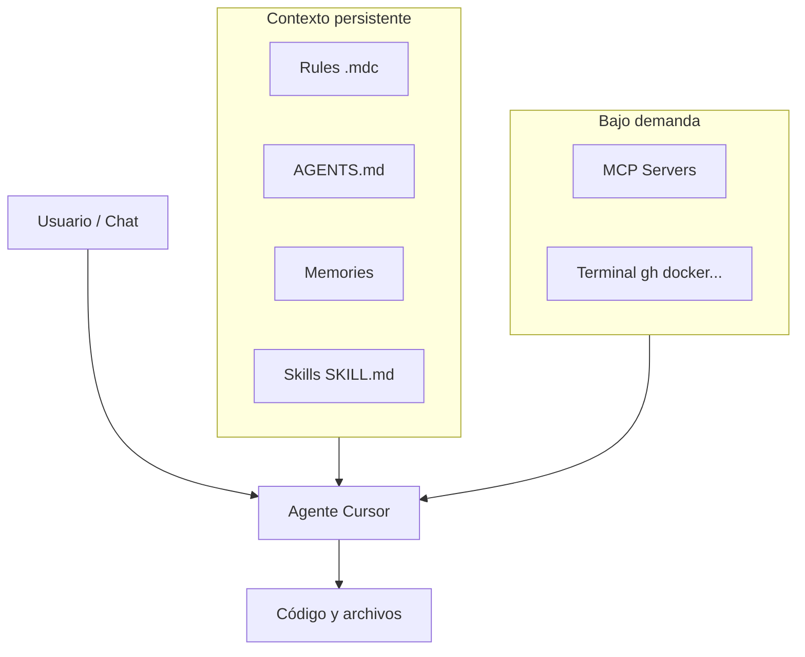

# df-cursor-101 — Fundamentos de Cursor

> Repositorio educativo para entender Cursor IDE: desarrollo con agentes, reglas, skills, memory, MCP, modelos e integración con skills de Claude.

**Autor:** [jmoralest](https://github.com/jmoralest)

---

## Objetivos

- Conceptos fundamentales de desarrollo asistido por IA en Cursor
- Configurar **Rules**, **Skills**, **Memory** y **MCP**
- Reutilizar **skills de Claude** dentro de Cursor (mismo estándar Agent Skills)
- Tips, trucos y guía paso a paso
- Ejemplos versionables listos para clonar y experimentar

---

## Inicio rápido

```bash
git clone https://github.com/jmoralest/df-cursor-101.git
cd df-cursor-101
```

1. Abre la carpeta en **Cursor**
2. Lee este README
3. Abre el agente (`Cmd+I`) y prueba: *«Explícame la diferencia entre rules y skills según docs/»*
4. Invoca el skill de ejemplo: `/crear-readme`

### Para agentes (harness)

Si eres un agente de IA trabajando en este repo, empieza por **`AGENT.md`** → **`docs/arquitectura-capas.md`** → `MEMORY.md` → `SKILLS.md`.

---

## Arnés en tres capas

| Capa | Qué es | Docs en este repo |
|------|--------|-------------------|
| **Contexto** | Rules, skills, memory, docs | [arquitectura-capas.md](docs/arquitectura-capas.md) |
| **Control** | Hooks, tests, checkpoints | [08-hooks.md](docs/08-hooks.md) |
| **Orquestación** | Features, progress, subagentes | [ejemplo-harness-subagentes](https://github.com/jmoralest/ejemplo-harness-subagentes) |

---

## Mapa visual del repo (graphify)

```bash
graphify update .
# Pedir al agente que etiquete comunidades y regenere HTML, o:
open graphify-out/graph.html
```

Guía completa: [docs/graphify.md](docs/graphify.md)

---

## Mapa de documentación

| # | Tema | Archivo |
|---|------|---------|
| 1 | Fundamentos de Cursor | [docs/01-fundamentos-cursor.md](docs/01-fundamentos-cursor.md) |
| 2 | Reglas (`.cursor/rules/`, `AGENTS.md`) | [docs/02-reglas.md](docs/02-reglas.md) |
| 3 | Skills (`SKILL.md`, estándar abierto) | [docs/03-skills.md](docs/03-skills.md) |
| 4 | Memory y persistencia | [docs/04-memory.md](docs/04-memory.md) |
| 5 | MCP (herramientas externas) | [docs/05-mcp.md](docs/05-mcp.md) |
| 6 | Modelos y Cursor SDK | [docs/06-modelos.md](docs/06-modelos.md) |
| 7 | **Skills de Claude en Cursor** | [docs/07-claude-skills-en-cursor.md](docs/07-claude-skills-en-cursor.md) |
| 8 | Hooks (automatización determinista) | [docs/08-hooks.md](docs/08-hooks.md) |
| 9 | Tips y trucos | [docs/09-tips-trucos.md](docs/09-tips-trucos.md) |
| 10 | **Tutorial paso a paso** | [docs/10-paso-a-paso.md](docs/10-paso-a-paso.md) |
| — | **Arquitectura en capas del arnés** | [docs/arquitectura-capas.md](docs/arquitectura-capas.md) |
| — | **Graphify** (mapa del repo) | [docs/graphify.md](docs/graphify.md) |

---

## Conceptos en 2 minutos

### Rules vs Skills vs Hooks

| | Rules | Skills | Hooks |
|--|-------|--------|-------|
| **Archivo** | `.cursor/rules/*.mdc` | `**/skills/**/SKILL.md` | `.cursor/hooks.json` |
| **Cuándo** | Siempre / por archivo / inteligente | Cuando es relevante o `/skill` | En eventos del IDE |
| **Propósito** | Convenciones, estilo | Flujos y conocimiento especializado | Lint, formato, guardas |
| **El modelo puede ignorarlo** | Sí | Sí | **No** |

### ¿Puedo usar skills de Claude en Cursor?

**Sí.** Cursor carga skills desde:

- `~/.claude/skills/` y `.claude/skills/` (compatibilidad directa)
- `~/.cursor/skills/` y `.cursor/skills/`
- `~/.agents/skills/` y `.agents/skills/` (estándar [agentskills.io](https://agentskills.io))

No necesitas convertir el formato si el `SKILL.md` sigue el estándar. Detalle completo en [docs/07-claude-skills-en-cursor.md](docs/07-claude-skills-en-cursor.md).

### Diagrama de contexto del agente



---

## Estructura del repositorio

```
df-cursor-101/
├── README.md                 # Este archivo (índice principal)
├── AGENTS.md                 # Entrada harness para herramientas compatibles
├── AGENT.md                  # Entrada para agentes en este repo
├── MEMORY.md                 # Referencia memory
├── SKILLS.md                 # Índice de skills
├── .cursor/
│   ├── rules/                # Ejemplos de reglas
│   │   ├── 00-cursor-basics.mdc
│   │   └── markdown-docs.mdc
│   └── skills/
│       └── crear-readme/     # Skill de ejemplo
│           └── SKILL.md
├── docs/                     # Guías (01–10 + arquitectura-capas + graphify)
└── graphify-out/             # Generado localmente (gitignored)
```

---

## Ejemplos incluidos

### Regla siempre activa

`.cursor/rules/00-cursor-basics.mdc` — convenciones de documentación del repo.

### Regla por tipo de archivo

`.cursor/rules/markdown-docs.mdc` — se adjunta al editar `docs/**/*.md`.

### Skill de proyecto

`.cursor/skills/crear-readme/SKILL.md` — plantilla y pasos para generar README.

---

## Crear tu primer skill (resumen)

```bash
mkdir -p .cursor/skills/mi-skill
```

`SKILL.md`:

```markdown
---
name: mi-skill
description: Describe QUÉ hace y CUÁNDO usarlo, en tercera persona, con palabras clave.
---

# Mi Skill

1. Paso uno
2. Paso dos
```

Ver tutorial completo: [docs/10-paso-a-paso.md](docs/10-paso-a-paso.md)

---

## Integración con otros modelos y herramientas

| Herramienta | Cómo compartir contexto |
|-------------|-------------------------|
| **Claude Code** | `CLAUDE.md`, `.claude/skills/`, `AGENTS.md` |
| **Cursor** | `.cursor/rules/`, `.cursor/skills/`, `AGENTS.md` |
| **Ambos** | `.agents/skills/` o `.claude/skills/` en el repo |
| **CI/CD** | [Cursor SDK](https://cursor.com/docs/sdk) (`@cursor/sdk`, `cursor-sdk`) |

---

## Tips rápidos

- Reglas **cortas**; flujos largos → skills
- `@archivo` para contexto preciso
- `/nombre-skill` para flujos repetibles
- Memories para preferencias personales; reglas en git para el equipo
- No editar `~/.cursor/skills-cursor/` (interno de Cursor)

Más: [docs/09-tips-trucos.md](docs/09-tips-trucos.md)

---

## Repos relacionados

- [ejemplo-harness-subagentes](https://github.com/jmoralest/ejemplo-harness-subagentes) — Harness engineering con subagentes
- [Cursor Docs](https://cursor.com/docs)
- [Agent Skills Standard](https://agentskills.io)

---

## Contribuir

1. Fork del repo
2. Rama con tu mejora (`docs/`, ejemplos en `.cursor/`)
3. Pull request con descripción clara

---

## Licencia

Material educativo de uso libre. Cursor y Claude son marcas de sus respectivos titulares.
